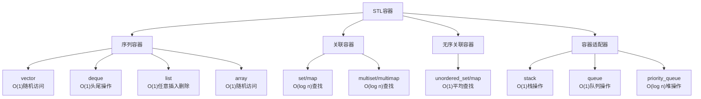
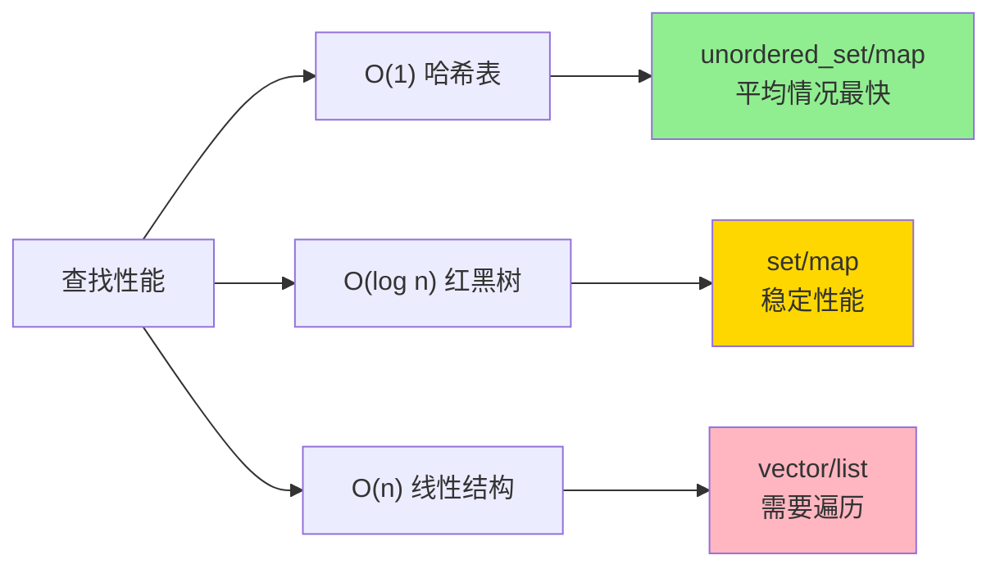
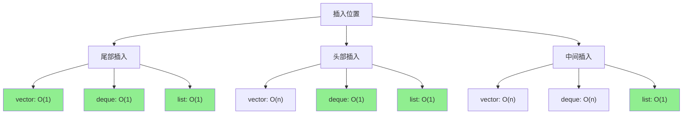
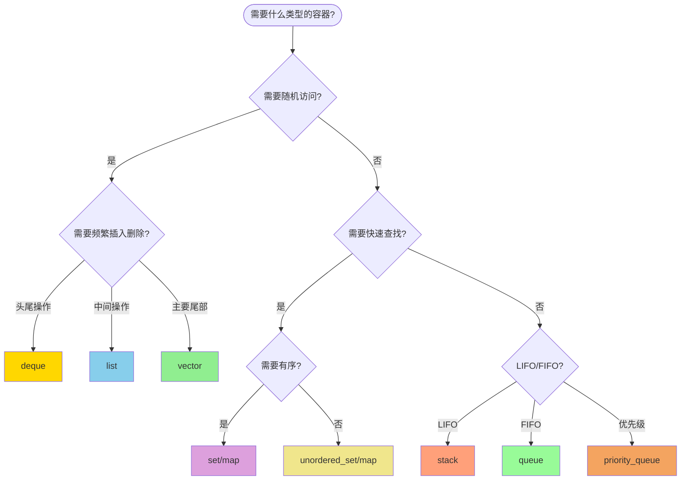

# C++ STL容器时间复杂度完整指南

## 📊 时间复杂度概览图

## 🔍 详细时间复杂度表格

### 📋 STL容器操作时间复杂度总览表

| 容器 | 按索引访问 | 按键访问 | 头部插入 | 尾部插入 | 中间插入 | 头部删除 | 尾部删除 | 中间删除 | 查找 | 排序 | 空间复杂度 |
|------|------------|----------|----------|----------|----------|----------|----------|----------|------|------|------------|
| **vector** | 🟢 O(1) | ❌ N/A | 🔴 O(n) | 🟢 O(1)* | 🔴 O(n) | 🔴 O(n) | 🟢 O(1) | 🔴 O(n) | 🔴 O(n) | 🔴 O(n log n) | O(n) |
| **deque** | 🟢 O(1) | ❌ N/A | 🟢 O(1) | 🟢 O(1) | 🔴 O(n) | 🟢 O(1) | 🟢 O(1) | 🔴 O(n) | 🔴 O(n) | 🔴 O(n log n) | O(n) |
| **list** | 🔴 O(n) | ❌ N/A | 🟢 O(1) | 🟢 O(1) | 🟢 O(1) | 🟢 O(1) | 🟢 O(1) | 🟢 O(1) | 🔴 O(n) | 🔴 O(n log n) | O(n) |
| **forward_list** | 🔴 O(n) | ❌ N/A | 🟢 O(1) | 🔴 O(n) | 🟢 O(1) | 🟢 O(1) | 🔴 O(n) | 🟢 O(1) | 🔴 O(n) | 🔴 O(n log n) | O(n) |
| **array** | 🟢 O(1) | ❌ N/A | ❌ N/A | ❌ N/A | ❌ N/A | ❌ N/A | ❌ N/A | ❌ N/A | 🔴 O(n) | 🔴 O(n log n) | O(n) |
| **set** | ❌ N/A | 🟡 O(log n) | 🟡 O(log n) | 🟡 O(log n) | 🟡 O(log n) | 🟡 O(log n) | 🟡 O(log n) | 🟡 O(log n) | 🟡 O(log n) | ✅ 自动排序 | O(n) |
| **multiset** | ❌ N/A | 🟡 O(log n) | 🟡 O(log n) | 🟡 O(log n) | 🟡 O(log n) | 🟡 O(log n) | 🟡 O(log n) | 🟡 O(log n) | 🟡 O(log n) | ✅ 自动排序 | O(n) |
| **map** | ❌ N/A | 🟡 O(log n) | 🟡 O(log n) | 🟡 O(log n) | 🟡 O(log n) | 🟡 O(log n) | 🟡 O(log n) | 🟡 O(log n) | 🟡 O(log n) | ✅ 自动排序 | O(n) |
| **multimap** | ❌ N/A | 🟡 O(log n) | 🟡 O(log n) | 🟡 O(log n) | 🟡 O(log n) | 🟡 O(log n) | 🟡 O(log n) | 🟡 O(log n) | 🟡 O(log n) | ✅ 自动排序 | O(n) |
| **unordered_set** | ❌ N/A | 🟢 O(1)** | 🟢 O(1)** | 🟢 O(1)** | 🟢 O(1)** | 🟢 O(1)** | 🟢 O(1)** | 🟢 O(1)** | 🟢 O(1)** | 🔴 O(n log n) | O(n) |
| **unordered_multiset** | ❌ N/A | 🟢 O(1)** | 🟢 O(1)** | 🟢 O(1)** | 🟢 O(1)** | 🟢 O(1)** | 🟢 O(1)** | 🟢 O(1)** | 🟢 O(1)** | 🔴 O(n log n) | O(n) |
| **unordered_map** | ❌ N/A | 🟢 O(1)** | 🟢 O(1)** | 🟢 O(1)** | 🟢 O(1)** | 🟢 O(1)** | 🟢 O(1)** | 🟢 O(1)** | 🟢 O(1)** | 🔴 O(n log n) | O(n) |
| **unordered_multimap** | ❌ N/A | 🟢 O(1)** | 🟢 O(1)** | 🟢 O(1)** | 🟢 O(1)** | 🟢 O(1)** | 🟢 O(1)** | 🟢 O(1)** | 🟢 O(1)** | 🔴 O(n log n) | O(n) |
| **stack** | ❌ N/A | ❌ N/A | 🟢 O(1) push | ❌ N/A | ❌ N/A | 🟢 O(1) pop | ❌ N/A | ❌ N/A | ❌ N/A | O(n) |
| **queue** | ❌ N/A | 🟢 O(1) push | ❌ N/A | ❌ N/A | 🟢 O(1) pop | ❌ N/A | ❌ N/A | ❌ N/A | ❌ N/A | O(n) |
| **priority_queue** | ❌ N/A | 🟡 O(log n) push | 🟡 O(log n) push | ❌ N/A | 🟡 O(log n) pop | 🟡 O(log n) pop | ❌ N/A | ❌ N/A | ✅ 自动排序 | O(n) |

**注释说明:**
- **按索引访问**: 如`container[0]`, `container.at(5)` - 通过数字索引访问
- **按键访问**: 如`map[key]`, `unordered_map[key]` - 通过键值访问
- `*` vector尾部插入：摊销O(1)，最坏情况O(n)（重新分配）
- `**` unordered容器：平均O(1)，最坏情况O(n)（哈希冲突）
- 🟢 O(1) - 常数时间，最优
- 🟡 O(log n) - 对数时间，良好
- 🔴 O(n) - 线性时间，一般
- ❌ N/A - 不支持该操作
- ✅ 自动排序 - 容器自动维护有序状态

### 🔑 访问方式详细对比

| 容器类型 | 按索引访问 | 按键访问 | 示例代码 | 时间复杂度 |
|----------|------------|----------|----------|------------|
| **vector** | ✅ 支持 | ❌ 不支持 | `v[0]`, `v.at(5)` | O(1) |
| **deque** | ✅ 支持 | ❌ 不支持 | `d[0]`, `d.at(5)` | O(1) |
| **list** | ❌ 不支持 | ❌ 不支持 | `advance(it, 5)` | O(n) |
| **array** | ✅ 支持 | ❌ 不支持 | `arr[0]`, `arr.at(5)` | O(1) |
| **set** | ❌ 不支持 | ✅ 支持 | `s.find(key)` | O(log n) |
| **map** | ❌ 不支持 | ✅ 支持 | `m[key]`, `m.at(key)` | O(log n) |
| **unordered_set** | ❌ 不支持 | ✅ 支持 | `us.find(key)` | O(1) 平均 |
| **unordered_map** | ❌ 不支持 | ✅ 支持 | `um[key]`, `um.at(key)` | O(1) 平均 |

### 🎯 常用操作函数对应表

| 操作类型 | vector | deque | list | set/map | unordered_set/map | stack | queue | priority_queue |
|----------|--------|-------|------|---------|-------------------|-------|-------|----------------|
| **插入** | `push_back()` | `push_front()` `push_back()` | `push_front()` `push_back()` `insert()` | `insert()` | `insert()` | `push()` | `push()` | `push()` |
| **删除** | `pop_back()` | `pop_front()` `pop_back()` | `pop_front()` `pop_back()` `erase()` | `erase()` | `erase()` | `pop()` | `pop()` | `pop()` |
| **访问** | `[]` `at()` | `[]` `at()` | 迭代器 | `find()` | `find()` | `top()` | `front()` `back()` | `top()` |
| **查找** | `find()` | `find()` | `find()` | `find()` `count()` | `find()` `count()` | ❌ | ❌ | ❌ |
| **大小** | `size()` | `size()` | `size()` | `size()` | `size()` | `size()` | `size()` | `size()` |
| **清空** | `clear()` | `clear()` | `clear()` | `clear()` | `clear()` | ❌ | ❌ | ❌ |

### 📊 性能特点对比

| 容器 | 最佳使用场景 | 优点 | 缺点 | 内存特点 |
|------|-------------|------|------|----------|
| **vector** | 频繁随机访问，尾部操作 | 缓存友好，随机访问快 | 中间插删慢，重新分配开销 | 连续内存，预分配 |
| **deque** | 头尾操作频繁 | 头尾操作快，支持随机访问 | 比vector稍慢，内存不连续 | 分块存储 |
| **list** | 频繁中间插删 | 插删快，不会失效迭代器 | 不支持随机访问，缓存不友好 | 链表节点 |
| **set/map** | 需要有序存储和快速查找 | 自动排序，查找稳定 | 插入删除较慢 | 红黑树节点 |
| **unordered_set/map** | 需要最快查找速度 | 查找极快（平均） | 哈希冲突时性能差，无序 | 哈希表+桶 |
| **stack** | LIFO后进先出 | 简单高效 | 功能单一 | 依赖底层容器 |
| **queue** | FIFO先进先出 | 简单高效 | 功能单一 | 依赖底层容器 |
| **priority_queue** | 优先级处理 | 自动维护最大堆 | 只能访问顶部 | 堆结构 |

### 1. 序列容器 (Sequence Containers)

| 容器 | 插入 | 删除 | 随机访问 | 查找 | 内存布局 | 适用场景 |
|------|------|------|----------|------|----------|----------|
| **vector** | 🟢 O(1) 尾部 🔴 O(n) 中间 | 🟢 O(1) 尾部 🔴 O(n) 中间 | 🟢 O(1) | 🔴 O(n) | 连续内存 | 频繁随机访问 |
| **deque** | 🟢 O(1) 头尾 🔴 O(n) 中间 | 🟢 O(1) 头尾 🔴 O(n) 中间 | 🟢 O(1) | 🔴 O(n) | 分块存储 | 头尾操作频繁 |
| **list** | 🟢 O(1) 任意位置 | 🟢 O(1) 任意位置 | 🔴 O(n) | 🔴 O(n) | 链表节点 | 频繁中间插删 |
| **forward_list** | 🟢 O(1) 任意位置 | 🟢 O(1) 任意位置 | 🔴 O(n) | 🔴 O(n) | 单向链表 | 内存敏感场景 |
| **array** | ❌ N/A | ❌ N/A | 🟢 O(1) | 🔴 O(n) | 连续内存 | 固定大小数组 |

### 2. 关联容器 (Associative Containers) - 基于红黑树

| 容器 | 插入 | 删除 | 查找 | 遍历 | 特点 |
|------|------|------|------|------|------|
| **set** | 🟡 O(log n) | 🟡 O(log n) | 🟡 O(log n) | 🟢 O(n) 有序 | 唯一元素，自动排序 |
| **multiset** | 🟡 O(log n) | 🟡 O(log n) | 🟡 O(log n) | 🟢 O(n) 有序 | 允许重复，自动排序 |
| **map** | 🟡 O(log n) | 🟡 O(log n) | 🟡 O(log n) | 🟢 O(n) 有序 | 键值对，键唯一 |
| **multimap** | 🟡 O(log n) | 🟡 O(log n) | 🟡 O(log n) | 🟢 O(n) 有序 | 键值对，键可重复 |

### 3. 无序关联容器 (Unordered Associative Containers) - 基于哈希表

| 容器 | 插入 | 删除 | 查找 | 遍历 | 负载因子影响 |
|------|------|------|------|------|--------------|
| **unordered_set** | 🟢 O(1) 平均 🔴 O(n) 最坏 | 🟢 O(1) 平均 🔴 O(n) 最坏 | 🟢 O(1) 平均 🔴 O(n) 最坏 | 🔴 O(n) 无序 | 哈希冲突严重时退化 |
| **unordered_multiset** | 🟢 O(1) 平均 🔴 O(n) 最坏 | 🟢 O(1) 平均 🔴 O(n) 最坏 | 🟢 O(1) 平均 🔴 O(n) 最坏 | 🔴 O(n) 无序 | 允许重复元素 |
| **unordered_map** | 🟢 O(1) 平均 🔴 O(n) 最坏 | 🟢 O(1) 平均 🔴 O(n) 最坏 | 🟢 O(1) 平均 🔴 O(n) 最坏 | 🔴 O(n) 无序 | 最常用的哈希表 |
| **unordered_multimap** | 🟢 O(1) 平均 🔴 O(n) 最坏 | 🟢 O(1) 平均 🔴 O(n) 最坏 | 🟢 O(1) 平均 🔴 O(n) 最坏 | 🔴 O(n) 无序 | 键可重复的哈希表 |

### 4. 容器适配器 (Container Adapters)

| 容器 | 插入操作 | 删除操作 | 访问操作 | 底层容器 | 用途 |
|------|----------|----------|----------|----------|------|
| **stack** | 🟢 O(1) push | 🟢 O(1) pop | 🟢 O(1) top | vector/deque/list | LIFO栈结构 |
| **queue** | 🟢 O(1) push | 🟢 O(1) pop | 🟢 O(1) front/back | deque/list | FIFO队列结构 |
| **priority_queue** | 🟡 O(log n) push | 🟡 O(log n) pop | 🟢 O(1) top | vector (堆) | 优先级队列 |

## 📈 性能对比图表

### 查找操作性能对比

### 插入操作性能对比

## 🎯 容器选择决策树

## � 实际代码性能对比

### 📝 常见操作场景对比表

| 操作场景 | 代码示例 | 推荐容器 | 时间复杂度 | 说明 |
|----------|----------|----------|------------|------|
| **大量随机访问** | `container[i] = value` | vector, array, deque | O(1) | 需要连续内存或支持随机访问 |
| **频繁尾部插入** | `container.push_back(value)` | vector, deque | O(1) | vector摊销O(1)，deque严格O(1) |
| **频繁头部插入** | `container.push_front(value)` | deque, list | O(1) | vector需要O(n)移动元素 |
| **中间位置插入** | `container.insert(it, value)` | list | O(1) | vector和deque需要O(n)移动 |
| **快速查找元素** | `container.find(key)` | unordered_set/map | O(1)平均 | set/map为O(log n) |
| **有序遍历** | `for(auto& x : container)` | set, map | O(n) | 自动维护有序，无需排序 |
| **范围查找** | `lower_bound(), upper_bound()` | set, map | O(log n) | 红黑树支持高效范围查询 |
| **栈操作** | `push(), pop(), top()` | stack | O(1) | LIFO操作 |
| **队列操作** | `push(), pop(), front()` | queue | O(1) | FIFO操作 |
| **优先级处理** | `push(), pop(), top()` | priority_queue | O(log n) | 堆操作 |

### 🔥 性能陷阱警告表

| 容器 | 常见性能陷阱 | 解决方案 | 示例代码 |
|------|-------------|----------|----------|
| **vector** | 频繁重新分配 | 预分配空间 | `v.reserve(expected_size)` |
| **vector** | 中间插入删除 | 使用list或deque | `list.insert(it, value)` |
| **unordered_map** | 哈希冲突 | 自定义哈希函数 | `unordered_map<Key, Value, CustomHash>` |
| **unordered_map** | 负载因子过高 | 控制负载因子 | `um.max_load_factor(0.75)` |
| **list** | 随机访问 | 使用vector或deque | `v[index]` 而不是 `advance(it, index)` |
| **set/map** | 频繁插入删除 | 考虑unordered版本 | 如果不需要有序 |
| **所有容器** | 不必要的拷贝 | 使用emplace | `v.emplace_back(args...)` |

## �💡 实际使用建议

### 🚀 高性能场景选择

1. **需要最快随机访问**: `vector` 或 `array`
2. **需要最快查找**: `unordered_map/set` (平均情况)
3. **需要稳定查找性能**: `map/set`
4. **需要频繁头尾操作**: `deque`
5. **需要频繁中间插删**: `list`

### ⚠️ 注意事项

- **vector**: 插入可能导致重新分配，迭代器失效
- **unordered容器**: 哈希冲突时性能急剧下降
- **list**: 不支持随机访问，缓存不友好
- **deque**: 比vector稍慢，但支持头部操作

### 🔧 性能优化技巧

1. **预分配空间**: `vector.reserve(n)`
2. **选择合适的哈希函数**: 自定义hash
3. **控制负载因子**: `unordered_map.max_load_factor()`
4. **使用emplace**: 避免不必要的拷贝构造

---

> 💡 **面试重点**: 重点掌握vector、map、unordered_map的时间复杂度，这是最常考的！
